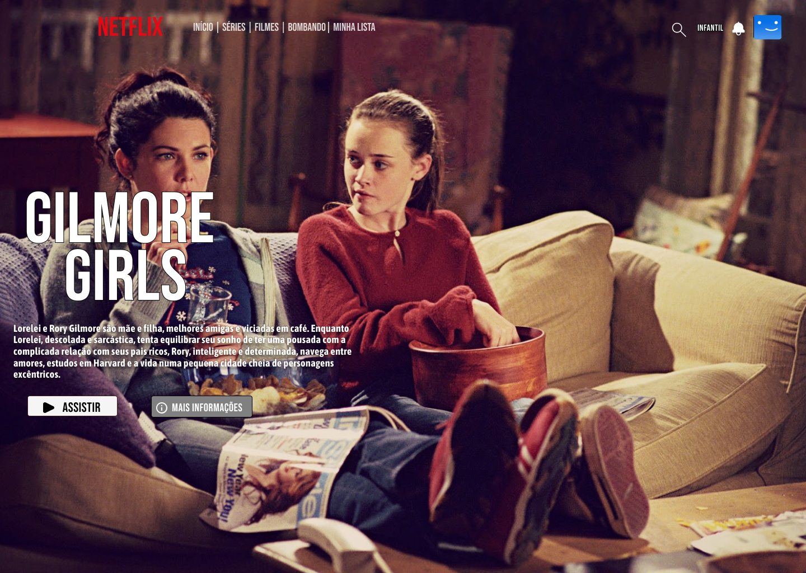

# Netflix UI Clone - Design no Figma

Este é um clone da interface da Netflix criado no Figma, como parte de estudos de UI Design.

## � Detalhes do Design
- **Ferramenta:** Figma
- **Tipo:** Static UI (ainda não implementado em código)
- **Status:** Em desenvolvimento ⚠️

## 📂 Arquivos Incluídos
- `netflix.png` (exportação da tela principal)

## 🔨 Próximos Passos
- [ ] Desenvolver o HTML/CSS/JS baseado no design 
- [ ] Adicionar interações (hover, carrossel)
      
## 🔗 Link do Figma
[Acesse o protótipo aqui](https://www.figma.com/file/za3IOEbl6jzMyWYObM3lQ7/netflix-clone?node-id=1001-2&t=Rj2wY54KpOL1HXie-0)

## 📄 Licença
Livre para uso educacional. 
